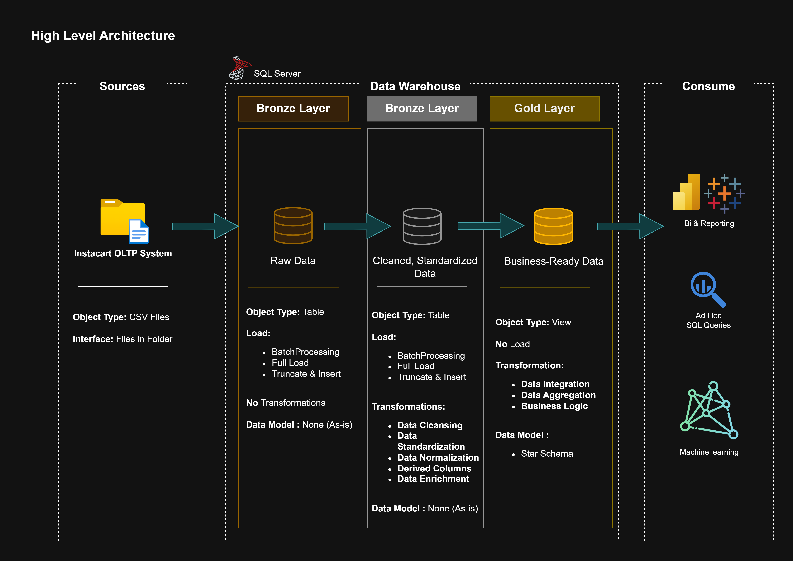

# Instacart Data Warehouse

Welcome to the **Instacart Data Warehouse Project** 🚀

This project demonstrates the design and implementation of a modern Data Warehouse using the **Instacart Market Basket Analysis** dataset and the **Medallion Architecture** approach. The goal is to transform raw transactional data into a structured, analytics-ready platform that supports business intelligence, reporting, and data-driven decision-making.

The solution follows a layered architecture:

* **Bronze Layer** – Raw data ingestion from source files.
* **Silver Layer** – Data cleansing, standardization, and quality validation.
* **Gold Layer** – Dimensional modeling and business-ready datasets for analytics.

Throughout this project, industry-standard Data Engineering practices are applied, including data modeling, ETL/ELT processes, data quality management, and warehouse design principles. The final solution provides a scalable foundation for analyzing customer purchasing behavior, product performance, reorder patterns, and other key retail insights.

Whether you are exploring Data Warehousing concepts, Medallion Architecture, or modern Data Engineering workflows, this repository provides a practical end-to-end implementation using a real-world retail dataset.

---

## 📑 Table of Contents

* [Architecture](#-architecture)
* [Tech Stack](#-tech-stack)
* [License](#️-license)
* [About Me](#-about-me)

---

## 🏗️ Architecture

  

This project implements a **Medallion Architecture** (Bronze → Silver → Gold) to transform raw Instacart source data into analytics-ready datasets.

### Architecture Overview

* **Bronze Layer** – Stores raw data ingested from source CSV files with minimal transformations.
* **Silver Layer** – Performs data cleansing, standardization, validation, and enrichment.
* **Gold Layer** – Contains business-ready fact and dimension tables optimized for analytics and reporting.

### Data Flow

1. Source CSV files are loaded into the **Bronze Layer** using SQL Server .
2. Raw data is cleansed, standardized, and validated in the **Silver Layer**.
3. Business entities are transformed into analytical models in the **Gold Layer**.
4. Gold-layer tables support reporting, dashboarding, and business analysis.

### Key Design Principles

* Medallion Architecture (Bronze, Silver, Gold)
* Separation of raw, cleansed, and business-ready data
* Reproducible ETL pipelines
* Scalable dimensional modeling
* Data quality validation and standardization

---

## 🛠️ Tech Stack

* SQL Server
* T-SQL
* Data Warehousing
* ETL / ELT Pipelines
* Medallion Architecture
* Data Modeling
* Git & GitHub

---
sql-data-warehouse-project/
│
├── datasets/
│   └── README.md
│
├── docs/
│   ├── images/
│   │   ├── data_architecture.png
│   │   ├── data_flow.png
│   │   ├── integration_model.png
│   │   └── data_model.png
│   │
│   ├── data_catalog.md
│   └── naming_conventions.md
│
├── scripts/
│   ├── init_database.sql
│   │
│   ├── bronze/
│   │   ├── ddl_bronze.sql
│   │   └── load_bronze.sql
│   │
│   ├── silver/
│   │   ├── ddl_silver.sql
│   │   └── load_silver.sql
│   │
│   ├── gold/
│   │   ├── ddl_gold.sql
│   │
│   └── etl/
│       └── create_load_log.sql
│
├── tests/
│   ├── quality_checks_gold.sql
│   └── quality_checks_silver.sql
│
├── .gitignore
├── LICENSE
└── README.md

---
## 🛡️ License

This project is licensed under the [MIT License](LICENSE). You are free to use, modify, and share this project with proper attribution.

---

## 🌟 About Me

Hi there! I'm **Abdelrahman**, also known as **ENYX**, a Computer Science student passionate about Data Engineering and Analytics. This project is part of my journey to build practical experience in SQL, Data Warehousing, ETL processes, and Data Modeling.

Thanks for stopping by, and feel free to explore the project! 🚀

### ☕ Let's Stay Connected

